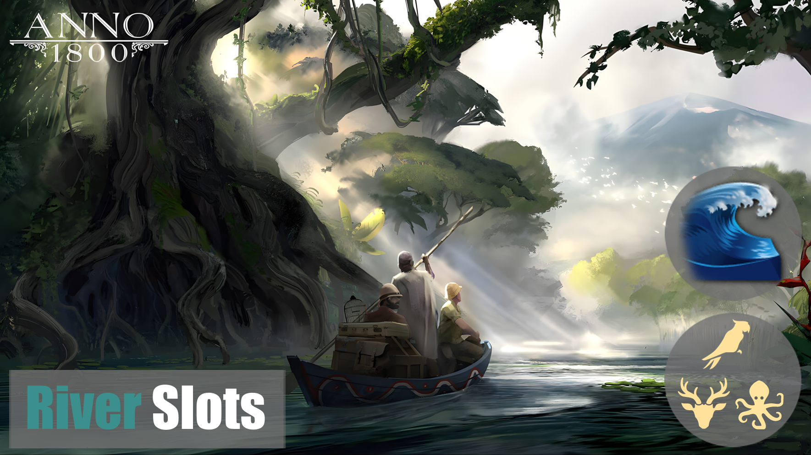
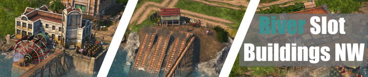

# RiverSlots
Für die deutsche Version des readmes, bitte [hier](readme_german.md) klicken.

This repo contains Island Files to integrate River Slots and accompanying River Slot Buildings like those found in Enbesa to all Old and New World Islands.

If you like this mod and want to support me, feel free to share it with your friends. You can also buy me a coffee at Ko-Fi (yes, I want to raise my coffee consumption to Investor's height!)

## How to use

- Either use [iModYourAnno](https://github.com/anno-mods/iModYourAnno/releases) mod manager or know [how to install mods manually](https://github.com/jakobharder/anno1800-mod-loader#mods).
- If you download the mod manually, use the archieve from [GitHub releases](https://github.com/Taludas/RiverSlots/releases). Don't download the whole repo!

**This mod REQUIRES a new savegame! Otherwise the islands will show no river slots.**  

**Due to the enourmos size of the island files, the mod consists of four zip files!**  
Please download all files to get the intended full experience. You could also choose to install only pairs of file, making the river slots available in the respective region.

**Known Incompatibilities**

Due to the nature of the mod, certain map template altering mods might interfere with my mod. These mods usually edit the map templates to include more/less continental islands (Crown Falls, Manola) or add them to other sessions. If you use those mods, you'll not get riverslots on the continental islands. All other islands that are added via the random pool are uneffected and will have river slots. It also depends on the load order position of the map mods. If my mod loads after it, there might be a good chance, that I overwrite changes from the map mod with my map template for Cap Trewlany. In this case CF will have river slots, but you miss the changes from the map mod.

## Changelog

    
Patch Notes Version 1.0.3

*  Adjustments
   - Added banners for the Building Mods.
   - Adjustments for all mods to the new features of iModYourAnno v0.5 (new images, default options are toggled automatically in the tweaking tab). ***WARNING***: Adjust your Tweaking options in iMYA before you continue playing, because those will be lost after update to v0.5!

    
Patch Notes Version 1.0.2

*  Hotfix for many small bugs:
   - Fixes the problem where the water mill for flour does not appear in the building menu for cookies.
   - Fixes the issue where AI opponents get stuck at farmer level because they want to build the river sawmill but can't, as it is only unlocked at artisan level.
   - Add several incompatibilities: Include NorthernRiversRemoved, MapSeeds Patch3 as they remove/change islands with river slots.
   - Adds compatibility with Jacob's Alternative Needs so that the vegetable farm reappears in the fish building menu.

    
Patch Notes Version 1.0.1

* New Feature:
    - Separate Build Menu for River Slot Buildings in both OW and NW (OW: end of farmers menu and beginning of needs menu, NW: after Warehouse in jornalero menu and beginning of needs menu)
    - German Readme

*  Hotfix for many small bugs:
    - River Sawmills in the OW and NW will now unhide properly with 1 Farmer/1 Jornalero
    - Fix double buildmenu entry issue for all buildings due to update to GU17.1, fixes for conditions when fallback entry appears in menu
    - Fix missing translation for River Sawmill NW in German localization
    - Fix graphic issues with Clay Collector OW/NW (Feedbackunit with AdapttoTerrainHeight clipping through mesh, Cutout mesh visible while using DX12)
    - Fix graphic issues with Gold Washer (Cutout mesh visible while using DX12)
    - Fix graphic issues with River Fishery and River Fishoil Factory (missing props and incorrect walking sequence on walking fisher)

    
Patch Notes Version 1.0.0

*  Initial Release
    - River Slots for Old and New World
    - Add initial River Slot Buildings for Old and New World
        - OW: River Fishery, River Clay Collector, River Sawmill, River Flour Mill, River Powerplant
        - NW: River Fishoil Factory, River Pearl Farm, River Clay Collector, River Sawmill, Gold Washer, River Powerplant 

## Mod Description with main feature overview
**Please remember to always check the Changelog to see the new or changed features.**

### Riverslots
On each island you can now find a varying number of riverslots (from 1 on the medium islands up to 10 on CF). These work exactly like the ones found in Enbesa. Slot buildings can be connected via both sides of the river slot. Since the UI is hardcoded, we unfortunately can't provide a nice interface to build buildings on the slot directly, you have to select them from the build menu.

This mod is mostly relevant as a modders ressource, providing the necessary island files to start a project with your own river slot buildings. So everyone feel free to include this in your own mod as a dependence via modinfo.json file. Due to the enourmous size of the mods I wouldn't recommend on providing them as a subfolder in your mod.  

### Riverslot Buildings OW
This Mod features five new buildings fitting for the newly introduced river slots in the Old World. They all produce vanilla goods at a sligthly faster rate than their non river counterparts. The River Powerplant has the same range as the vanilla Oil Powerplant. You can either find the buildings inside their respective production chains, a separate building category or directly next to the vanilla building.

Following buildings are available for River Slot construction:
- River Fishery (50 Farmers)
- River Clay Collector (1 Worker)
- River Sawmill (1 Artisan)
- River Flour Mill (1 Artisan)
- River Powerplant (1 Engineer)

You can use iMYA to tweak which buildings you would like to play with.

### Riverslot Buildings NW
This Mod features six new buildings fitting for the newly introduced river slots in the New World. They all produce vanilla goods at a sligthly faster rate than their non river counterparts. The River Powerplant has the same range as the vanilla Oil Powerplant. You can either find the buildings inside their respective production chains, a separate building category or directly next to the vanilla building.

Following buildings are available for River Slot construction:
- River Fishoil Factory (50 Jornaleros)
- River Pearlfarm (500 Jornaleros)
- River Clay Collector (1 Obrero)
- River Sawmill (1 Obrero)
- Gold Washer (300 Obrero)
- River Powerplant (900 Artista)

You can use iMYA to tweak which buildings you would like to play with.

## Special Thanks
Thank you to Taubenangriff for providing River Slot Locations for the five vanilla NW large islands and the 6 vanilla medium islands. He had the original idea behind this mod way back in the early days of the New Horizons Project, but since the addition of River Slots is quite tedious, I jumped in and found suitable locations for all the Old World islands as well as the newly added New World islands after DLC12.
